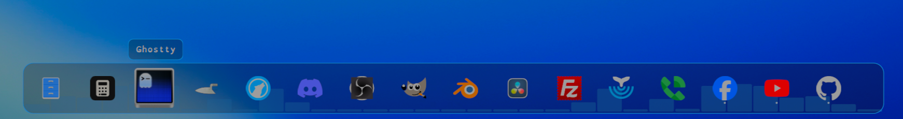

# PrimoDock



A native, highly polished animated application dock designed for **Omarchy Quattro** (Quickshell & Hyprland). PrimoDock brings fluid macOS-inspired dock physics, intelligent window tracking, multi-window management, and seamless theme synchronization to your Linux desktop.

---

##  Key Features

-  **Smart Launching & Switching** — Click an icon to launch an application or instantly switch to the exact workspace where it is already running.
-  **Multi-Window Support & Cycling** — Right-click any running app to view all open windows with titles and workspace badges, or click repeatedly / use the scroll-wheel to cycle through open instances.
-  **Persistent Favorites** — Pin or unpin applications instantly via the right-click action menu (`★` / `☆`). Pinned favorites persist across reboots and workspace switches.
-  **Drag & Drop Reordering** — Fluid drag-and-drop icon reordering directly on the dock surface with automatic persistence of your custom layout.
-  **Quick Window Controls** — Manage windows on the fly from the right-click action card: close individual windows, close all instances, or minimize to dock.
-  **Seamless Omarchy Theme Sync** — Automatically synchronizes with your active Omarchy system colors, accent borders, glassmorphism opacities, and window corner radiuses.
-  **Live Status Indicators** — Glowing accent dots beneath each icon display active running states (one dot per open window, highlighting the currently active window).
-  **Dynamic Positioning** — Intelligently detects and adapts to screen dimensions and Omarchy bar placement (top, bottom, left, or right).
-  **Quickshell & IPC Integration** — Fully integrated with Omarchy shell lifecycle management and direct IPC controls (`primo.dock`).

---

## 🖱️ Interaction Guide

| Action | Behavior |
| :--- | :--- |
| **Left-Click** | Launch application, focus running window, or cycle through open windows. |
| **Right-Click** | Open window list, close individual windows, toggle pin status, or access dock settings. |
| **Middle-Click** | Launch a brand new independent instance of the application. |
| **Scroll Wheel** | Cycle through open windows of the hovered application. |
| **Drag & Drop** | Click and drag an icon horizontally or vertically to reorder your dock items. |

---

## ⚙️ IPC & Management

PrimoDock exposes a native Quickshell IPC target (`primo.dock`) for scripting and automation:

```bash
# Toggle dock visibility
quickshell ipc call primo.dock toggle

# Open dock
quickshell ipc call primo.dock open

# Close dock
quickshell ipc call primo.dock close
```

Set the dock toggle as a hyprland binding:
o.bind("SUPER + SHIFT + ALT + Space", "", { launch = 'bash -c "quickshell -p /usr/share/omarchy/shell ipc call primo.dock toggle"' })

---

## 🗑️ Uninstallation

To remove PrimoDock from your Omarchy environment:

```bash
omarchy plugin remove primo.dock
```

---

## 📄 License

[MIT](./LICENSE) © 2026 primo
